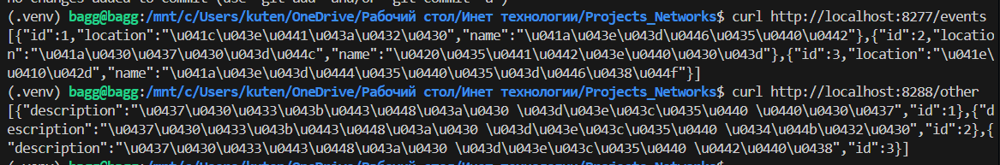
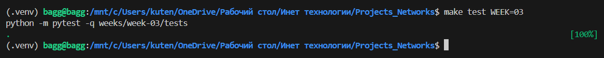

# Единая точка входа (API Gateway)

## Задача
В реальной жизни микросервисов много, но клиент (фронтенд или мобильное приложение) не должен знать адреса каждого из них. Для этого используют **API Gateway** — единую точку входа. На этой неделе мы спрячем наш микросервис за Nginx.

## Мой вариант
`variants/<433>/<s14>/week-03.json`

## Что нужно сделать
1. **Поднять второй сервис**:
   - Запустите ещё один экземпляр вашего приложения (или простой mock-сервис) на другом порту.
   - Пусть первый сервис отвечает за `/<resource>`, а второй — за `/other`.
2. **Настроить Nginx**:
   - Nginx должен слушать порт 80 (или 8080).
   - Запросы на `/api/v1/<resource>` должны уходить в первый сервис.
   - Запросы на `/api/v1/other` должны уходить во второй сервис.
3. **Проверить**:
   - Клиент делает запрос только в Nginx.
   - Nginx сам решает, куда переслать запрос (маршрутизация).
   

## Что сдавать
1. Конфиг Nginx (`nginx.conf`).
2. `docker-compose.yml` (если используете).
3. Ответы на вопросы.
   3.1. В чем разница между Forward Proxy (обычный прокси) и Reverse Proxy (обратный прокси)?
      Forward Proxy: прокси для клиента (скрывает клиента от сервера)
      Reverse Proxy: прокси для сервера (скрывает серверы от клиента)
   3.2. Что такое Upstream в терминологии Nginx?
      Upstream - это бэкенды, куда Nginx кидает запросы 
   3.3. Зачем скрывать реальные IP-адреса сервисов от клиента?
      Безопасность - злоумышленники не знают реальные адреса серверов
      Гибкость - можно менять серверы без изменения клиентских настроек
   3.4. Какие еще задачи, кроме маршрутизации, может выполнять API Gateway (назовите хотя бы 2)?
      Аутентификация, логирование,  кеширование
   3.5. Что произойдет, если Gateway упадет? Как можно от этого защититься?
      Все сервисы станут недоступны для клиентов
## Как проверить
```bash
make test WEEK=03

```
Тесты будут стучаться в Nginx и ожидать ответа от бэкенда.
