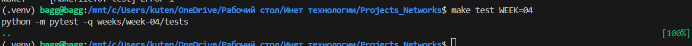

# Саги и распределенные транзакции

## Задача
В распределенной системе нет единой базы данных, поэтому нет и привычных ACID-транзакций ("всё или ничего"). Если один сервис сохранил заказ, а второй упал при списании денег — у нас проблема (несогласованность данных).
На этой неделе мы реализуем паттерн **Saga** (Сага) — способ управления транзакциями через последовательность шагов и их отмену (компенсацию).

## Ваш вариант
`variants/<GROUP>/<STUDENT_ID>/week-04.json`
Вам понадобится поле `project_code`.

## Что нужно сделать
1. **Описать Сагу**:
   - В файле `app/saga.py` или `saga.md` опишите шаги вашего бизнес-процесса.
   - Например: "Создать заказ" -> "Зарезервировать товар" -> "Списать деньги".
2. **Реализовать состояния заказа**:
   - `NEW` (создан)
   - `PAID` (оплачен)
   - `DONE` (завершен)
   - `CANCELLED` (отменен)
3. **Реализовать компенсацию**:
   - Если на шаге оплаты произошла ошибка, система должна автоматически вернуть товар на склад (отменить резерв) и перевести заказ в статус `CANCELLED`.
   - Если отмена резерва не удалась — нужно попробовать еще раз (retry), пока не получится.

## Что сдавать
1. Код реализации саги (оркестратора или хореографии).
2. Диаграмму переходов статусов (можно в `saga.md`).
3. Ответы на вопросы.
   3.1. Почему в микросервисах нельзя просто использовать `BEGIN TRANSACTION ... COMMIT` для операций, затрагивающих несколько сервисов?
      У каждого микросервиса своя база данных. Нельзя сделать одну транзакцию на разные БД
   3.2. В чем разница между Оркестрацией и Хореографией? Какой подход проще для старта, а какой лучше масштабируется?
      Оркестрация: есть главный сервис-дирижер, который управляет всеми. Проще для старта, понятнее логика.
      Хореография: сервисы общаются через события, каждый знает что делать дальше. Лучше масштабируется, нет единой точки отказа.
   3.3. Что такое "компенсирующая транзакция"? Приведите пример.
      Это отмена того, что уже сделано. НАпример, отмена брони на товар, за который не прошла оплата в срок.
   3.4. Может ли компенсирующая транзакция завершиться ошибкой? Что делать в таком случае?
      Повторять, пока не получится
   3.5. Что такое "согласованность в конечном счете" (Eventual Consistency)?
      Когда данные становятся согласованными не сразу, но через какое-то время приходят в нужное состояние.

## Как проверить
```bash
make test WEEK=04
```
